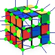
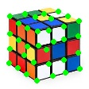
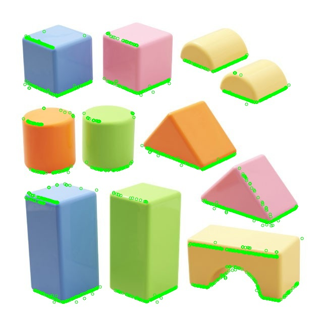
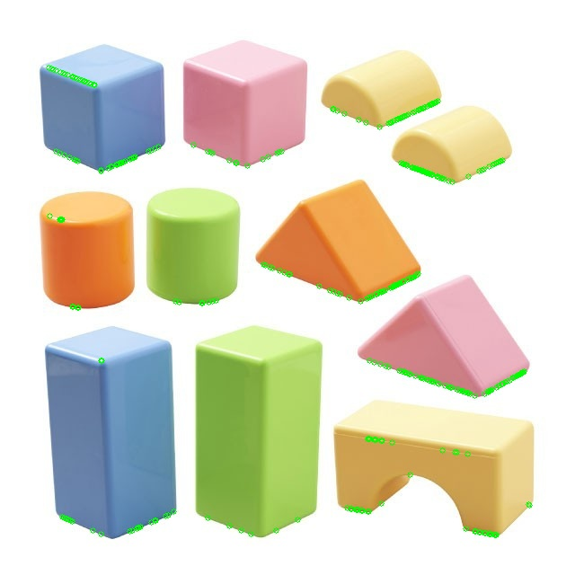
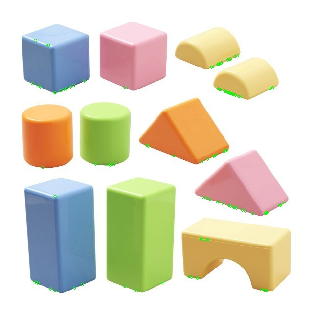

# vSLAM

## Camera Connection

download [iriun webcam](https://iriun.com/) on both phone and pc.

```pip install opencv-python```

# ORB (Oriented FAST and Rotated BRIEF)

## FAST (Features from Accelerated Segment Test) Algorithm
- Choose one pixel and let $I_p$ be its pixel value and let $t$ be the threshold value.
- Create a Bresenham circle of radius 3 around the pixel
- Check if there are 3 or more pixels from pixels 1, 5, 9, 13 with pixel value greater than $I_p+t$ or 3 or more pixels with pixel values less than $I_p-t$
- Check if there are 12 or more pixels from the circle with a pixel value greater than $I_p+t$ or 12 or more pixels with pixel values less than $I_p-t$
- Append to a list of corners
- Repeat for all pixels of the image


</br>

## Harris Corner Detection
*After obtaining candidate corner points from FAST, we now further refine and narrow down the actual corners.*
First we want a function that can calculate the variation in intensity if we move in a small direction $(u, v)$ from our point of interest $(x, y)$. $$E(u, v) = \sum_{x, y} w(x, y) [I(x + u, y + v) - I(x, y)]^2$$ where $I$ is an intensity function. Using the first-order taylor approximation, $$I(x + u, y + v) \approx I(x, y) + uI_x(x, y) + vI_y(x, y)$$ Substituting, we get $$E(u, v) \approx \sum_{x, y} w(x, y) [uI_x(x, y) + vI_y(x, y)]^2 = \sum_{x, y} w(x, y) [u^2I_x(x, y)^2 + uvI_xy(x, y) + v^2I_y(x, y)^2]$$ We can rewrite this in matrix form,
<br>

<br>
Let <br>  <br>
This is the harris matrix we are interested in. The eigenvalues of this matrix represent the variance in orthogonal directions. If both eigenvalues are large, there is high variance in two directions, meaning that the point of interest is a corner. If one eigenvalue is much larger than the other, it should correspond to an edge, and if both are small, we can think of it as flat. In order to derive an equation for the "cornerness" of a point, we assign it an R-value, $$R = \det(H) - k (\mathrm{trace}(H))^2$$ where a higher R represents a higher quality corner, and k is an experimentally determined constant ($0.04 - 0.06$). We determined a threshold for the minimum value of R and only accepted points above this threshold.


</br>

## Non-Maximum Suppression

The issue when it comes to finding corners is that there can be multiple pixels defined as a corner for one corner. In order to fix this, we use a technique called non-maxmimum suppression. The idea behind this algorithm is that we take the point with the highest R value in a given area, and remove the other points. This leaves us with only the "highest quality corner" corners for a given area.

</br>

## Intensity Centroid Orientation

The intensity moment from a certain pixel can be found as: $$m_{pq} = \displaystyle\sum_{x, y}x^py^qI(x,y)$$

The angle of the line from the corner to the centroid can be determined as: $$\theta = \arctan2(m_{01}, m_{10})$$

</br>

## BRIEF (Binary Robust Independent Elementary Feature)

Each corner can be encoded using a binary descriptor: 
$$\tau(p;x,y) = 
\begin{cases}
1 & \quad p(x) <br p(y)\\
0 & \quad p(x) \geq p(y)
\end{cases}
$$
Where $\tau(p;x,y)$ is the binary test, and $p(x)$ and $p(y)$ are intensities of randomly chosen pixel pair $x$ and $y$

</br>

## Oriented FAST Test Images








## FAST Corner detection vs. threshold






     


